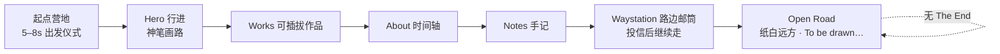

# lucky 个人主页 — 设计与开发方案
# lucky Portfolio — Design & Development Plan

> 版本 v1.3 · 中英双语 · 依据：参考图 × 设计提示词 × 用户决策
> Status: Spec locked for build — 可进入 M0 手感原型  
> 品牌 **lucky** · 主标 **Code with craft. Design with soul.** · 语言 **中 + 英**  
> 本版变更：**无终点叙事 + 起点营地开场** · **作品可插拔内容模型**  
> v1.2.1 变更：游戏化节奏（速度曲线 / 里程 HUD / 本地最佳）、障碍语法扩容（集群）、平台自适应操作、夜空点缀随系统时间

---

## 0. 结论摘要 / Executive Summary

**一句话：** 打开页面先在**起点营地**完成 5–8s 出发仪式，随后神笔一路向右画出前路，三只吉祥物在已画好的线上前进；**这条路没有终点**——章节是沿途风景，Contact 是路边邮筒，结尾是道路消失在纸白远方（画笔仍在画）。

| 决策 | 选择 | 理由（先说结论） |
|---|---|---|
| 品牌 / 主标 | **lucky** / *Code with craft. Design with soul.* | 已拍板 |
| 语言 | **中文 + English** | 已拍板 |
| **开场** | **起点营地 + 5–8s 出发仪式（可跳过）** | 先教会隐喻再放权；比冷启动跑酷更完整 |
| **结局** | **不设终点**；道路延伸至纸白远方 | 作品集没有「完成」；终点叙事与「一直画下去」冲突 |
| **Contact** | **路边邮筒 / 路边驿站**（旅途中的歇脚点） | 保留 CTA，去掉「到达终点」暗示 |
| **作品管理** | **一文件一件**（content/works）+ 状态机 | 可插拔：增删文件即增删作品 |
| 滑行 | 右键 / 键盘 / 下滑；禁双击；长按不触发 | 见 §5.2 |
| 角色 | 岗位向导制 | 一章一主场，不铺满卡片 |
| 转场 | 单世界连续滚动（Lenis） | 保「一条被画出来的路」 |
| 渲染 | Canvas 2D + SVG | 线稿噪声足够 |

---

## 1. 品牌与叙事 / Brand & Narrative

### 1.1 定位

**边走边画的数字手艺人 / Digital craftsman who draws the road while walking.**

品牌名：**lucky**。整页是**一条没有终点的路**：

```text
[起点营地]  →  [路上不断画出的风景与作品]  →  [路边邮筒]  →  [纸白远方 · 未完]
   出发              Works · About · Notes              Contact          无 The End
```

**为什么取消终点营地：** 终点 = 完成 = 停下。Portfolio 与手艺是持续的；把篝火做成终点会把品牌说成「已交付完毕」。改成**起点**后，篝火是「出发前的暖」，叙事开口，记忆点更强。

### 1.2 口号体系（中英并行，已定稿）

| 层级 | EN | ZH | 用在哪 |
|---|---|---|---|
| **主标** | Code with craft. Design with soul. | 用匠心写代码，以灵魂做设计。 | Hero Display |
| 副标 | Keep walking, keep drawing. | 边走边画，把每天画得更新一点。 | Hero 主标下 |
| 出发 CTA | Set out | 出发 | 开场可跳过按钮 / reduced-motion |
| About 宣言 | Draw the road as we go. | 路是边走边画出来的。 | About 首 |
| 开放式结尾 | To be drawn… | 未完，还在画。 | 全页最末 |
| 操作引导 | [LMB] Jump · [RMB] Slide ｜ [↺] ｜ [⏸] | [左键] 跳跃 · [右键] 滑行 ｜ [↺ 重绘] ｜ [⏸ 暂停] | Hero 右下 |
| 触控引导 | [Tap] Jump · [Swipe ↓] Slide | [轻点] 跳跃 · [下滑] 滑行 | 移动端 |
| 邮筒 CTA | Send a note | 寄一张明信片 | Contact |

Hero 大字两行：

```text
Code with craft.
Design with soul.
```

### 1.3 声音 / Tone of Voice

- 短句、动词开头、不堆形容词。
- 治愈来自留白 + 拟人动作，不来自文案自夸。
- 结尾禁用「The End / 旅程结束 / 终点」等词；用「未完 / To be drawn / still walking」。

---

## 2. 视觉系统 / Design System

### 2.1 色板 Palette

```text
--paper        #FFFFFF   纸面底
--ink          #18181A   墨线 / 正文
--ink-soft     #8A8A90   次级文字
--line-faint   #E8E8EA   分割线 / 空心字描边
--accent-lemon #FFDE59   手绘柠檬黄（背包、时钟、高亮）
--accent-orange#FF9F43   暖雾橙（起点篝火、强调、hover）
--accent-sage  #70A07B   鼠尾草绿（成功、植物、标签）
```

**纸张噪点：** `feTurbulence` 或 512px 平铺 PNG，`opacity: 0.02`，multiply。不画进 Canvas。  
**点缀纪律：** 同屏最多 2 个 accent。起点篝火是橙色的最大浓度点。  
**纸面：** 恒为纸白 #FFFFFF;夜间(22:00–5:00)画布以墨线画月牙与两三颗星（随系统时间）。

### 2.2 字体 Typography

| 用途 | 字体栈 | 规格 |
|---|---|---|
| Display EN | `"SF Pro Display", "Inter", -apple-system, sans-serif` | 72–128px / 500–600 / -0.02em |
| 空心标题 | 同上 | 描边 2px `--line-faint`，fill transparent |
| CJK Display | `"Noto Sans SC", "PingFang SC", sans-serif` | 28–40px / 500 |
| Body EN | Inter / SF Pro Text | 16–18px / 400 / 1.7 |
| Body CJK | Noto Sans SC / PingFang SC | 14–16px / 400 / 1.9 |
| Mono | `"SF Mono", "JetBrains Mono", monospace` | 12–13px |

字号阶梯：`display 96/48 · h1 64/34 · h2 48/28 · h3 28/20 · body 17/15 · caption 13/12`  
CJK 字重仅 400/500；英文 Display 负字距，中文微正 `+0.04em`。

### 2.3 线稿语言 Line Quality

| 元素 | 规范 |
|---|---|
| 线宽 | 主地面 2px / 装饰 1.5px / 细节 1px |
| 抖动 | 顶点 2D value noise，振幅 0.6–1.2px，频率 0.08 |
| 端点 | round cap/join |
| 断笔 | 每 80–120px 缺口 4–8px，缺口率 ≤ 8% |
| 填充 | 角色道具可白填充 + 墨线；地面不填充 |

顺序：光滑折线 → 抖动 → 挖断笔。

### 2.4 间距与布局 Grid

单位 8px；节奏 `8/16/24/40/64/96/128`。内容宽 1120px，Hero 文案 720px。桌面边距 64px，移动 20px。章节呼吸 128–180px。Bento 12 列不对称，卡圆角 20px，边框 1.5px ink。

---

## 3. 角色设定 / Mascot Cast

| 角色 | EN | 造型 | 色 |
|---|---|---|---|
| 栗子鼠 | Chestnut | 圆脸花栗鼠，不对称耳形、蓬松尾巴、柠檬黄小背包 | 棕 + `#FFDE59` |
| 云朵兔 | Cloudy | 水滴形纯白垂耳兔，长短软耳、低位豆豆眼 | 白 + 墨线 |
| 煤球鸟 | Kuro-Kuro | 略不规则的黑绒团，顶部小羽毛、细腿和小翅膀 | `#18181A` |

**行进：** 贴地 `y = heightAt(x)`；Chestnut / Cloudy / Kuro-Kuro 的视觉跳跃延迟 `0 / 40 / 80ms`，物理判定共享；滑行 `0.75s`，视觉高度约 ×0.4；踉跄 1.5s 归队 1.15×。

**原型：** 角色与路线同在 Canvas 2D，保证贴地、遮挡和笔尖时序一致。**Astro 阶段：** 分章岗位角色可迁为 SVG + GSAP。

### 3.1 分章出场：岗位向导制

完整三只编队出现在 **起点营地出发** 与 **沿途可重聚时刻**；内容章一章一主场，副角最多 1。

| 场景 | 主场 | 姿态 | 副角 |
|---|---|---|---|
| **起点营地（开场）** | 全员 | 围火：伸懒腰、背包装填、递水壶 | — |
| **出发仪式** | 全员 | 起立 → 指向前方 → 追笔行走 | — |
| **Hero 行进** | 全员 | 路上小队 | — |
| **Works** | 栗子鼠 | 检视员：趴特色卡上沿晃脚 / 掀角 | 鸟站 `↗` |
| **About** | 全员 | 沿时间轴走、踩节点盖章 | 兔坐里程碑 |
| **Notes** | 云朵兔 | 伏案写字、图钉 | 鸟衔日期牌 |
| **路边邮筒（Contact）** | 全员（路过） | 走过邮筒时投一封信 / 挥手，**不停下、不坐下** | — |
| **纸白远方** | 剪影变小 | 仍在走，未完 | — |

**Works 卡：** 只让 Chestnut 出现在至多 1 张特色卡；Bento 不放角色。  
**移动：** 每章仅主场角色。

**与 v1.1 差异：** 删除「终点营地烤棉花糖」。若要保留烤棉花糖梗，改在**起点营地出发前**当早餐/补给（收背包），不要在结尾摆「终于到了」。

---

## 4. 核心机制：神笔画路 / Pen Drawing System

全站灵魂；冲突时保画笔。

### 4.1 坐标与锚定

```text
(X_draw, Y_draw) = (viewport.w * 0.85, terrain(x_at_pen))
```

笔屏位置 ≈ 85% 视口宽，Y 随路线采样；笔尖锁在当前连续墨迹最前端。主路线、笔尖、角色贴地、倾角、粒子与碰撞读取同一份路线几何；新线被画出、旧线离场。

### 4.2 姿态

| 参数 | 规则 |
|---|---|
| 倾角 θ | `clamp(atan2(dy,dx)*0.85, ±15°)`，切线低通 0.15 |
| 下压 | 接触新顶点 80ms：法线位移 2px + scale(0.98) |
| 噪声 | ±0.8° 1D noise |
| 尺寸 | 笔长 ≈ 视口高 18%（移动 14%）≥ 72px |

### 4.3 墨迹粒子

笔尖发射 3–5 颗/秒；墨点/铅屑/星光 = 3:6:1；寿命 0.35–0.6s；池化 ≤ 64。

### 4.4 隐喻强化

1. **Idle：** 4s 无输入画一小段波浪示范。  
2. **光标：** 离开 Hero 后为笔尖；Works hover 轻点。  
3. **Redraw：** `?seed=` 可分享；↺ 换 seed——行进中重绘时地线回营地端，补画前沿 0.3–0.5s 快速重描。

---

## 5. 地形与交互 / Terrain & Controls

### 5.1 地形

**一笔成景：** 路线是按 seed 生成并缓存的连续 polyline；每个 `x` 对应一个可走高度，笔沿同一条有方向的墨迹推进。每个地貌都有入点 → 主轮廓 → 出点，端点高度与切线连续，角色只踩已完成的路线。

主词汇：平地 35% · 缓坡/云丘 20% · 溪谷/泥洼/石台（跳）20% · 拱脊/低矮通道（滑或整体跃过）15% · 远景装饰 10%。建筑、树、花、路牌和里程碑仅是辅助笔画，不改变主路线或碰撞。视差 0.2× / 0.5× / 1.0×。Seed 可播种，默认 `20260215`。

低矮通道由笔在同一次地貌描绘中连续画出拱形顶部；其顶部与判定宽度附着在路线特征区间中，不使用独立桥洞/山洞物件或前景白填充。溪谷、泥洼和石台保留跳跃语义。

**开场地形：** 起点营地为固定手绘段（火堆、木箱、指示牌），随后无缝接入 procedural 路。指示牌文案可写 `Next →` 而不是 `Finish`。

**节奏曲线：** 行进速度 120 起、每秒 +0.8、封顶 190；踉跄回落 `max(120, 当前−40)` 再爬升。障碍间隔与判定带随速度等比缩放（判定带因子 0.5×速度/120），各障碍时间窗恒定、反应时间守恒；跳跃水平行程随速度自然增长。

**障碍语法：** 跳（溪/谷/泥洼——**线在此断开**（断口两端垂滴两笔），没有线的地方必须腾空；石台——**立在路线上的一块石头**，线保持连续）、滑（低矮通道/长隧道/矮枝/晾衣绳/横栏/残拱，按住持续滑行、松手起身）、装饰（拱/山/云）；滑跳连招模板：双谷（落地续跳）、通道后溪谷（滑完即跳）、石台后矮枝（跳完即滑）。节奏由路线牌堆循环保证。触屏（coarse pointer）无滑行输入——低矮通道降级为溪流；canvas `touch-action: pan-y`，页面滚动不被画布吞。

**里程碑：** 每 1000px（=100m）由笔画出里程碑石，HUD 轻脉冲；最佳里程存 localStorage（仅本地）。

### 5.2 输入（已定稿）

| 输入 | 动作 |
|---|---|
| 左键 / 轻点 / Space / ↑ | Jump |
| **右键 / Shift / S / ↓**（按住） | Slide 持续滑行，松手起身（最短 0.25s 防抖） |
| **下滑**（触控主） | Slide |
| 空中 ↓ / S / 右键 | 快速下坠（参考 Chrome 小恐龙），落地即 Slide |
| 左键 | **仅 Jump**（禁止长按触发 Slide） |
| 双指长按 | 兼容别名（不推广） |
| **双击** | **禁止绑定 Slide** |
| Esc / ⏸ | 暂停 |
| ↺ | 重绘 |
| **任意输入（开场中）** | **跳过出发仪式** |

`contextmenu` 必须 `preventDefault`。Input Buffer 0.08s / 0.06s，Coyote 0.08s。失败只踉跄。

### 5.3 物理初值

```text
gravity 2600（跳跃顶点 |vy|<160 时 ≈1500 悬挂加弧度） · jumpImpulse -860 · 滑行=按住持续态（最短 0.25s · 松手 0.1s 起身 · 姿态过渡 0.12s；左键永不滑行）
moveSpeed 120 · hitStop 80ms · rejoinBoost 1.15×
```

---

## 6. 页面结构与转场 / IA & Transitions

### 6.0 总原则

- **单世界连续滚动**（Lenis + ScrollTrigger），无多页硬切、无 scroll-snap。  
- **无终点：** 滚到底不是「结束」，是「路还在往前画」。  
- 导航 = 锚点缓滚 0.9s。语言切换热替换，不重载场景。

### 6.1 开场：起点营地 → 出发仪式（5–8s，可跳过）【本版核心】

**目标：** 不读文案也能看懂「笔画路、人走路」。**任何输入立即结束仪式**，禁止把用户按在片头里。

```text
首帧（LCP）     起点营地静态可读（火、三只、地面已存在）
t 0.0–1.8s      营地呼吸：火苗轻晃，角色伸懒腰 / 扣背包
t 1.8–3.2s      Chestnut 指向右侧；画笔在 85% 处轻轻落位、笔尖点地
t 3.2–6.0s      画笔绘出第一段路；小队起立走上新线（墨粒）
t 6.0–8.0s      控制提示轻脉冲一次；完全交权
```

- **Skip：** 滚轮 / 触摸 / 点击 / 按键 → 直接进入「行进态」（营地段已预画到笔尖，无欠账）。  
- **`prefers-reduced-motion`：** 停自动仪式；营地下方只显示主按钮 **「出发 / Set out」**。  
- **回顶：** 滚回 Hero 时**不重播**仪式，直接行进态（避免每次回顶都像片头）。

### 6.2 信息架构（无终点）

```text
[00 Start Camp / Hero]  起点营地 + 出发仪式 + 主标 + 操作
        ↓ 画笔持续向右
[01 Works]              可插拔作品（内容驱动）
        ↓ 地面弯折
[02 About]              线稿时间轴
        ↓
[03 Notes]              手记列表
        ↓
[04 Waystation]         路边邮筒 · Contact（路过式，非终点）
        ↓
[05 Open Road]          路消失进纸白 · To be drawn…（无 The End）
```

### 6.3 Hero / 起点营地

- 导航：毛玻璃胶囊；品牌 **lucky** + 笔尖 logo；Works / About / Notes / Contact + 中/EN。导航与全部可跳转链接 hover/focus 高亮为暖橙（accent-orange），滚动至对应章节时导航锚点着色（scrollspy）。  
- 主标：`Code with craft. Design with soul.` + 副标 `边走边画，把每天画得更新一点。`  
- 场景左：起点营地（火、木箱、指路牌 `Next →`）；右：神笔在画。  
- 操作提示右下，开场交权后自动淡出；HUD 上画布——右上角里程（mono），左上角 ⏸/↺ 小圆钮；移动端画布 58vh。

### 6.4 Works（可插拔）

- 空心 `WORKS` + `精选项目`。  
- 特色大卡 ×2 左右交错 + Bento 3–4 格。  
- **数据驱动渲染**（见 §7.4）：增删作品 = 增删一个 content 文件，不改组件。  
- Hover：卡上浮、图标动画、Chestnut 敲卡面。

### 6.5 About

地面弯折成时间轴；宣言 `Draw the road as we go.`；全员沿轴走。  
条目示例：2024 TimeSense · 2025 开源图标集 · 2026 lucky 本站。

### 6.6 Notes

空心 `NOTES` + 列表 `日期 · 标题 · ↗`。Cloudy 伏案，鸟衔日期牌。  
详情页为唯一二级路由：「翻开笔记本」0.24s。

### 6.7 Waystation 路边邮筒（替代终点营地 Contact）【本版核心】

**不是终点仪式，是路过时的路边设施。**

- 空心 `CONTACT` + `寄一张明信片 / Send a note`。  
- 画面：**手绘邮筒立在路边**；小队**走过**时投一封信或挥手，继续前进（不停、不坐下、不熄火）。  
- 主 CTA：邮箱大链接（可配 `hello@lucky.dev`）+ 社交图标行。  
- 可选彩蛋：hover 邮筒 → 投信口弹出小星星。  
- **不要**出现篝火晚会、棉花糖、坐定、「再见」。

### 6.8 Open Road 开放式结尾（替代「尾页」）

- 道路用一点透视消失在纸白；画笔缩小到远景仍在画（或仅留墨粒）。  
- 大字只有一句：**未完，还在画。 / To be drawn…**  
- 版权行：`© 2026 lucky · Still on the road.`  
- 无大 CTA 墙；Contact 已在 Waystation 完成。

### 6.9 转场机制

```text
导航点击 → Lenis.scrollTo(0.9s)
                │
        ScrollTrigger scrub
    ┌───────────┼──────────┬────────────┐
 空心标题     地面弯折    角色换岗     视差换层
 dash 描出    Hero→About  走位入场     0.2×/0.5×
```

- Hero→Works：线延伸为章节顶饰，WORKS 描出，Chestnut 上岗。  
- Works→About：地面下弯 90° 成轴，画笔改纵向描轴。  
- About→Notes：轴尾散成纸页。  
- Notes→Waystation：场景拉回地平线，邮筒从远处走近（视差）。  
- Waystation→Open Road：透视拉向灭点，**不减速到停止**——卷动触底时保留极缓的余速感（可用 2% 线宽抖动 + 远景微移，而不是真正 auto-scroll）。

---

## 7. 技术架构 / Technical Architecture

### 7.1 栈

| 层 | 选择 |
|---|---|
| 站点 | Astro 5 + Content Collections |
| 场景 | Canvas 2D |
| UI | SVG |
| 原型角色 | Canvas 2D |
| 动效 | GSAP + ScrollTrigger |
| 滚动 | Lenis |
| i18n | 自研字典 zh-CN / en |
| 语言 | TypeScript |
| 部署 | 静态托管 |

原型：`paper-road/index.html` 单文件先验手感。

### 7.2 运行时结构

```text
DOM（语义 HTML / i18n 热替换）
SVG（页面岗位角色、插画、邮筒、纸噪）
Canvas（营地段 + 一笔成景路线 + 原型角色 + 画笔 + 墨粒 + 视差）
```

**模块：**
- `terrain.ts` · `inkPath.ts` · `pen.ts` · `mascots.ts` · `scene.ts`
- `intro.ts` — 起点营地出发仪式与 Skip
- `scrollStory.ts` — 连续转场、弯折、换岗、Open Road
- `works/registry.ts` — 从 content/JSON 读作品并排序过滤
- `i18n.ts`

### 7.3 坐标

```text
drawX = cameraX + viewportW * 0.85
screenPen = (0.85 * vw, heightAt(drawX) - cameraY)
```

路径 polyline ≤ 2048 点；**碰撞与绘制共用同一几何**。

### 7.4 作品可插拔内容模型【本版核心】

**原则：** 增删作品 = 增删一个文件；**禁止**改 React/Astro 卡片源码去登记作品。

#### 目录约定

```text
content/
  works/
    timesense.md          ← 一件作品一个文件
    swingcat.md
    lucky-road.md
  notes/
    2026-02-15-timesense.md
public/
  assets/works/
    timesense.svg
    swingcat.svg
data/
  site.json               ← 品牌、邮箱、社交（全局一处）
```

#### Work 文件 Schema（frontmatter + 可选正文）

```yaml
---
id: timesense                 # 唯一，与文件名一致
status: featured              # featured | bento | draft
order: 10                     # 越小越靠前
date: 2024-06-01
title:
  zh: TimeSense
  en: TimeSense
tagline:
  zh: 「快一点」会变成习惯的约定。
  en: A little faster becomes a habit.
meta:
  zh: 育儿闹钟 + 声音计时器
  en: Kids timer + sound clock
link: https://example.com/timesense
art: /assets/works/timesense.svg
artHover: /assets/works/timesense-hover.svg   # 可选
mascot: peek                  # peek | sit-arrow | none
tags: [product, kids]
---
可选 MD 正文：详情页长文（Notes 式）。
```

#### 状态机

| status | 列表页 | 详情页 | 用途 |
|---|---|---|---|
| `featured` | 特色大卡区 | 有 | 主推，最多 2–3 个 |
| `bento` | Bento 区 | 有 | 次级/实验 |
| `draft` | 不渲染 | 不渲染 | 写到一半 |

#### 渲染规则

1. 构建时收集 `content/works/*` → zod 校验 → 过滤 `draft` → 按 `order` 再 `date` 排序。  
2. `featured` 进第一行交错大卡；`bento` 进网格；两者皆空时显示空状态插画（Cloudy 拿着空白相框）。  
3. `mascot: peek` 的 featured 最多 1 个被 Chestnut 选中（取 `order` 最小）；`sit-arrow` 的 Kuro-Kuro 挂在主外链。  
4. 中英字段成对缺失时构建报错（防漏翻）。  
5. 删除作品 = 删文件；下线但保留 = 改 `status: draft`。

#### 原型期（M0–M2）简化版

```text
data/works.json   ← 同一 schema 的 JSON 数组
```

单文件原型直接 import 该 JSON；M4 迁到 Astro Content Collections 时 schema 不变。

#### 管理工作流（给人用的）

| 操作 | 步骤 |
|---|---|
| **新增** | 复制 `content/works/_template.md` → 改 frontmatter → 丢图到 `public/assets/works/` |
| **下线** | `status: draft`（推荐）或删文件 |
| **置顶** | 改 `order: 1` |
| **换文案** | 只改 frontmatter 的 zh/en |
| **校验** | `npm run works:check`（zod + 唯一 id + 双语齐全） |

#### 明确不做的事

- 不做后台 / CMS / 数据库（个人站过重）。  
- 不在组件里 `hardcode` 作品数组。  
- 不为「未来可能有」预留插件 RPC；文件即插件。

---

## 8. 动效与手感 / Motion & Game Feel

| 事件 | 动效 | 时长 | 缓动 |
|---|---|---|---|
| 开场营地呼吸 | 火苗、伸懒腰 | 0–1.8s | sine |
| 出发 | 指路 → 笔落位 → 画路 → 行走 | 3.2–6s | `power2.inOut` |
| Skip | 交叉淡入行进态 | 0.2s | `power1.out` |
| 起跳 / 落地 / 滑行 / 踉跄 | 同 v1.1 | — | — |
| 落地 | 小尘 2–3 粒 | 0.2s | ease-out |
| 里程碑（每 100m） | HUD 轻脉冲 + 笔画里程碑石 | — | — |
| 路径 | 即时画出 | — | — |
| 空心标题 | dash 描出 | 0.8s | `power2.inOut` |
| 地面→时间轴 | morph + dashoffset | scrub | linear |
| 邮筒路过 | 投信 / 挥手 | 0.7s | `back.out(1.6)` |
| Open Road | 透视灭点，极缓微移 | 常驻 | linear |
| 锚点跳转 | Lenis | 0.9s | 自定 |

手感优先级：跳 > 滚 > 其他。

---

## 9. 响应式 · 无障碍 · 性能

### 9.1 断点

| 断点 | 要点 |
|---|---|
| ≥1200 | 画笔 85%；开场完整三只 |
| 768–1199 | 画笔 88% |
| <768 | 画笔 90%；开场可缩短至 5s；每章主场一只；触控文案 |

### 9.2 无障碍

1. `prefers-reduced-motion`：无仪式动画，营地图 + 「出发 / Set out」按钮；全站停自动卷轴与粒子。  
2. 键盘：Tab 可达；Space/↑ 跳；Shift/S/↓ 滑行；Esc 可跳过开场。  
3. 开场有 `role="region" aria-label="出发仪式"` + 可见 Skip。  
4. Works 为真实 `<a>`；时间轴 `<ol>`；邮筒区有可见邮箱文本。  
5. 正文对比度 ≥ 4.5:1（主文字 ≈ 16:1）。  
6. 音频默认关，导航提供开关（跳/滑/里程碑三枚极简音）。
7. 最佳里程存 localStorage（仅本地，不上报）。

### 9.3 性能

| 指标 | 目标 |
|---|---|
| LCP | < 2.0s（**首帧即营地静态图**，不靠 JS 才出画） |
| Hero JS（gz） | < 120KB |
| 帧率 | 60fps / 低配 30fps |
| 粒子 | ≤ 64 |
| 路线采样点 | ≤ 2048 |

降级：60 → 减粒子 → 减断笔 → 30 → 静态图。

---

## 10. 开发里程碑 / Milestones

| 阶段 | 内容 | 产出 | 预估 |
|---|---|---|---|
| M0 手感原型 | 营地开场草图 + 画路 + 双键 | 单文件可玩 | 2–3 天 |
| M1 开场仪式 | 5–8s 出发 + Skip + reduced-motion | 隐喻可教学 | 1–2 天 |
| M2 页面结构 | Works/Ax/Notes/Waystation/Open Road | 可滚全页 | 3 天 |
| M3 叙事转场 | 弯折、换岗、邮筒路过、灭点 | 无终点成立 | 2 天 |
| M4 工程化 | Astro + **works content** + i18n + a11y | 可维护上线 | 3 天 |
| M5 打磨 | 真作品录入、手感 | 上线候选 | 2 天 |

**M0 验收（硬）：** 画笔在角色前方；笔连续描出地貌，角色只踩在同一条已完成路线；右键无菜单；双击不滚；开场可跳过；**页尾无「终点」语义**。
**M4 验收（硬）：** 新增作品 = 只加一个 md/JSON 文件即可出现在正确区块。

---

## 11. 相对原提示词的改动 / Changes vs Original Brief

### 本版（v1.2）已定

- **无终点**；终点营地 → **起点营地出发仪式（5–8s，可跳过）**。  
- Contact → **路边邮筒 Waystation（路过式）**。  
- 页尾 → **Open Road / 未完，还在画**。  
- **作品可插拔**：`content/works/*` + status/order 双语 schema。

### 此前已定

- lucky · *Code with craft. Design with soul.* · 中英。  
- 滑行禁双击、禁左键长按；右键 + 键盘 + 下滑。  
- 角色岗位向导制；单世界连续滚动。  
- reduced-motion、Input Buffer、共用几何、空心标题、Notes、不上 Pixi。

### 仍建议保留的 P2

- 画笔自定义光标；声音默认关；`?seed=` 分享；内容与 i18n 解耦。

---

## 12. 双语文案清单 / Copy Inventory (ZH / EN)

### Global

| Key | ZH | EN |
|---|---|---|
| brand | lucky | lucky |
| nav.works | 作品 | Works |
| nav.about | 关于 | About |
| nav.notes | 手记 | Notes |
| nav.contact | 联系 | Contact |
| lang | 中文 | EN |

### Intro / Hero

| Key | ZH | EN |
|---|---|---|
| hero.title | 用匠心写代码，以灵魂做设计。 | Code with craft. Design with soul. |
| hero.sub | 边走边画，把每天画得更新一点。 | Keep walking, keep drawing. |
| hero.skip | 跳过出发 | Skip intro |
| hero.setout | 出发 | Set out |
| hero.hint.desktop | [左键] 跳跃 · [右键] 滑行 ｜ [↺ 重绘] ｜ [⏸ 暂停] | [LMB] Jump · [RMB] Slide ｜ [↺ Redraw] ｜ [⏸ Pause] |
| hero.hint.touch | [轻点] 跳跃 · [下滑] 滑行 | [Tap] Jump · [Swipe down] Slide |

### Sections

| Key | ZH | EN |
|---|---|---|
| works.title | 作品 | WORKS |
| works.sub | 精选项目 | Selected projects |
| works.empty | 还在路上收集。 | Still collecting on the road. |
| about.title | 关于 | ABOUT |
| about.manifesto | 路是边走边画出来的。 | Draw the road as we go. |
| notes.title | 手记 | NOTES |
| notes.sub | 制作笔记 | Making notes |
| notes.all | 阅读全部 | Read all notes |
| contact.title | 联系 | CONTACT |
| contact.sub | 寄一张明信片 | Send a note |
| contact.email_label | 写信给我 | Email me |
| openroad.title | 未完，还在画。 | To be drawn… |
| footer.credit | 还在路上。 | Still on the road. |

### Sample Works

| Key | ZH | EN |
|---|---|---|
| work.timesense.desc | 「快一点」会变成习惯的约定。 | A little faster becomes a habit. |
| work.swingcat.desc | 集中时的那点悠哉。 | A little ease while you focus. |

---

## 附录 A — 视觉 Token

```css
:root {
  --paper: #FFFFFF;
  --ink: #18181A;
  --ink-soft: #8A8A90;
  --line-faint: #E8E8EA;
  --accent-lemon: #FFDE59;
  --accent-orange: #FF9F43;
  --accent-sage: #70A07B;
  --font-display: "SF Pro Display", "Inter", -apple-system, sans-serif;
  --font-cjk: "Noto Sans SC", "PingFang SC", sans-serif;
  --font-mono: "SF Mono", "JetBrains Mono", monospace;
  --radius-card: 20px;
  --radius-pill: 999px;
  --line-w: 2px;
}
```

## 附录 B — 无终点叙事图



## 附录 C — 开场时间线

```text
0s          1.8s           3.2s              6s            8s
│  营地呼吸   │  指路+笔落位  │  画第一段路并行走  │  提示脉冲  │  交权
└── 任意输入 Skip ─────────────────────────────────────┘
```

## 附录 D — 作品插拔

```text
content/works/foo.md  ──add──►  自动出现在 WORKS（按 status/order）
content/works/foo.md  ─del──►  列表消失
status: draft         ──────►  保留文件但不发布

featured → 特色大卡（≤2–3）
bento    → 网格
draft    → 隐藏
```

## 附录 E — 滑行裁决

```text
Slide 需求 → 右键 / Shift·S·↓ / 下滑
            ✕ 双击禁用
            ✕ 左键长按禁用（左键只跳）
```

---

## 下一步 / Next Steps

1. **M0** `paper-road/`：营地开场草图 + 可玩卷轴。  
2. **M1** 出发仪式 5–8s + Skip + reduced-motion。  
3. **M2–M3** 无终点全页 + 路边邮筒 + Open Road。  
4. **M4** `content/works/` 可插拔上线。

设计无需再拍板即可开工。若要改开场时长（5s / 6s / 8s）或邮筒文案，直接改 §6.1 / §12。
