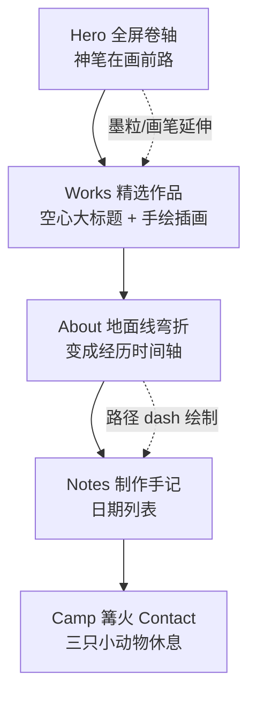

# Syncraft 个人主页 — 设计与开发方案
# Syncraft Portfolio — Design & Development Plan

> 版本 v1.0 · 中英双语 · 依据：参考图 × 设计提示词  
> Status: Proposal — 确认后进入实现  
> 工作品牌暂用参考图中的 **Syncraft**，文案可替换为你的正式命名。

---

## 0. 结论摘要 / Executive Summary

**一句话：** 做一张「纸上无限卷轴」——右侧神笔实时画出前方道路，三只吉祥物在已画好的线稿地面上追逐；页面往下滚时，地面线弯折成时间轴，收束在篝火营地的 Contact。

| 决策 | 选择 | 理由（先说结论） |
|---|---|---|
| 视觉锚点 | Apple 产品页大字留白 × 日系绘本线稿 | 参考图已验证；负空间是「治愈」的主要来源 |
| 签名机制 | 右侧画笔实时绘路 + 墨点粒子 | 全站唯一不可替代的记忆点，预算优先 |
| 第二签名 | 空心描边章节大标题（WORKS / NOTES） | 参考图识别符号，成本低、回报高 |
| 渲染方案 | **Canvas 2D + SVG**，不上 Pixi.js | 线稿手绘感靠路径噪声，不需要精灵批处理 |
| 框架 | Astro（内容站）+ 单文件 Canvas Island | Notes 要长期写，SSG 比 SPA 更合适 |
| 失败反馈 | 踉跄 + 小星星，不扣血不通关 | Portfolio 不是游戏，友好机制保留 |
| 语言 | 默认中文 / English 切换（可选日文皮肤） | 你要求中英文；日文只作美学参考层 |

**相对原提示词，我建议改 6 处（详见 §11）：** 补 Notes 信息架构；Bento 与参考图的左右插画布局合并为「特色大卡 + 列表」；移动端补滑动翻滚；`prefers-reduced-motion` 强制降级；画笔在页面其他区域变为自定义光标延伸；声音默认关闭。

---

## 1. 品牌与叙事 / Brand & Narrative

### 1.1 定位

**边走边画的数字手艺人 / Digital craftsman who draws the road while walking.**

不是「作品陈列柜」，而是「手艺人带着作品在路上」。整页是一条被画出来的路：Hero 是出发，Works 是路边捡到的成果，About 是脚印连成的履历，Notes 是路边写下的便签，Footer 是今晚的篝火。

### 1.2 口号体系（中英并行）

| 层级 | EN | ZH |
|---|---|---|
| 主标 | Crafting ideas in sync. | 与想法同步生长。 |
| 备主标（提示词原案） | Code with craft. Design with soul. | 用匠心写代码，以灵魂做设计。 |
| 副标 | Keep walking, keep drawing. Every day a little newer. | 边走边画，把每天画得更新一点。 |
| 操作引导 | [LMB] Jump · [RMB] Roll ｜ [↺ Redraw] ｜ [⏸ Pause] | [左键] 跳跃 · [右键] 翻滚 ｜ [↺ 重绘] ｜ [⏸ 暂停] |

**建议：** 主标用参考图的 *Crafting ideas in sync.*（更短、更有品牌记忆），把提示词的 *Code with craft. Design with soul.* 降为 About 章节的宣言句。两套都不要挤在首屏。

### 1.3 声音 / Tone of Voice

- 短句、动词开头、不堆形容词。
- 日系治愈来自「留白 + 拟人动作」，不来自文案里的「治愈」「温暖」字样。
- 中文避免翻译腔；英文避免空洞的 “passionate / creative / innovative”。

---

## 2. 视觉系统 / Design System

### 2.1 色板 Palette

```text
--paper        #FFFFFF   纸面底
--ink          #18181A   墨线 / 正文
--ink-soft     #6B6B70   次级文字
--line-faint   #E8E8EA   分割线 / 空心字描边
--accent-lemon #FFDE59   手绘柠檬黄（背包、时钟、高亮块）
--accent-orange#FF9F43   暖雾橙（篝火、强调、hover）
--accent-sage  #70A07B   鼠尾草绿（成功、植物、标签）
--star         #FFDE59   踉跄小星星（复用 lemon）
```

**纸张噪点：** 全屏 `feTurbulence` SVG 或 512px 平铺 PNG，`opacity: 0.02`，`mix-blend-mode: multiply`。**不要画进 Canvas**——会让 WebGL/Canvas 层变脏且难降级。

**点缀色纪律：** 同屏最多出现 2 个 accent。黄色=角色与工具，橙=温度与行动点，绿=自然与标签。禁止三色同时抢焦点。

### 2.2 字体 Typography

| 用途 | 字体栈 | 规格 |
|---|---|---|
| Display EN | `"SF Pro Display", "Inter", -apple-system, sans-serif` | 72–128px / 500–600 / tracking -0.02em |
| Display 空心标题 | 同上 | 描边 2px `--line-faint`，填充 transparent（章节标题） |
| CJK Display | `"Zen Kaku Gothic New", "Noto Sans SC", "PingFang SC", sans-serif` | 28–40px / 500 |
| Body EN | Inter / SF Pro Text | 16–18px / 400 / lh 1.7 |
| Body CJK | Zen Kaku Gothic New / Noto Sans SC | 14–16px / 400 / lh 1.9 |
| Mono（代码/日期） | `"SF Mono", "JetBrains Mono", monospace` | 12–13px |

**字号阶梯（桌面 / 移动）：**  
`display 96/48 · h1 72/36 · h2 48/28 · h3 28/20 · body 17/15 · caption 13/12`

**排版原则：**  
1）标题区允许占屏 40% 高度只放两行字；  
2）CJK 字重只用 400/500，不用 700（会破坏绘本感）；  
3）英文 Display 负字距，日/中 Display 微正字距 `+0.04em`。

### 2.3 线稿语言 Line Quality

| 元素 | 规范 |
|---|---|
| 线宽 | 主地面 2px，装饰 1.5px，细节 1px |
| 颜色 | 统一 `#18181A`，不用灰线画主结构 |
| 抖动 | 路径细分后对顶点叠加 2D value noise（振幅 0.6–1.2px，频率 0.08） |
| 端点 | `round` cap / `round` join，制造笔尖停顿感 |
| 断笔 | 长路径每 80–120px 随机 4–8px 缺口（手绘呼吸），缺口率 ≤ 8% |
| 填充 | 角色与道具允许 `#FFFFFF` 填充 + 墨线描边；场景地面不填充 |

**实现要点：** 先生成光滑折线 → 再做 noise 抖动 → 再挖断笔缺口。顺序反了会得到「脏线」而不是「手绘线」。

### 2.4 间距与布局 Grid

- 基础单位 `8px`；节奏 `8 / 16 / 24 / 40 / 64 / 96 / 128`。
- 内容最大宽 `1120px`；Hero 文案块 `720px`。
- 桌面安全边距 `64px`，移动 `20px`。
- **超大负空间是设计语言，不是浪费：** Works 卡片间距 24px，但章节之间垂直呼吸 128–180px。
- Bento：12 列网格，允许 `span 7 / span 5 / span 4` 的不对称；卡片圆角 20px，边框 1.5px ink。

---

## 3. 角色设定 / Mascot Cast

三只角色是一支「行进小队」，不是三个独立 IP 挂件。队形固定：栗子鼠领跑 → 云朵兔居中 → 煤球鸟压阵。

| 角色 | EN | 造型 | 步态 | 色 |
|---|---|---|---|---|
| 栗子鼠 | Chestnut | 圆滚花栗鼠，竖耳，背柠檬黄小背包 | 匀速小跑，尾微翘，背包带轻弹 | 棕 + `#FFDE59` |
| 云朵兔 | Cloudy | 纯白垂耳兔，圆身短腿 | 走路微弹（squash & stretch），耳朵滞后摆动 | 白 + 墨线 |
| 煤球鸟 | Kuro-Kuro | 豆豆眼纯黑小毛团，细腿 | 快频碎步，身体略滞后跟上 | `#18181A` |

**绑定规则：**
- 贴地：脚底锚点 = 当前世界 x 处地形高度 `y = terrain(x)`，法线对齐（小坡可倾斜 ±12°）。
- 三人共享 x 速度，但保留 12–20px 的弹性间距（弹簧阻尼），急停会「追尾」挤一下——可爱，不要修掉。
- 跳跃：三人同步收到冲量，但延迟 0 / 40 / 80ms 错发起跳，显得队伍有人味。
- 翻滚：各自变球、自转 720°/0.55s，hitbox 高度 × 0.4。
- 踉跄：向前扑 → 坐地 0.35s → 3 颗小星星冒出 → 小跑追回队形（1.2s 加速到 1.15× 再回落）。

**绘制：** 全部 SVG path，动画用 GSAP 或 CSS transform，不进 Canvas（与地形层解耦，方便做插画复用）。

---

## 4. 核心机制：神笔画路 / Pen Drawing System

这是全站灵魂。任何功能冲突时，保画笔。

### 4.1 坐标与锚定

```text
世界坐标 x_world(t) = 自动向右卷动
绘制点 (X_draw, Y_draw) = (viewport.w * 0.85, terrain(x_at_pen))
```

- 画笔**屏幕位置**固定在约 85% 视口宽（右边距 10%–15%），只在 Y 上跟随地形起伏。
- **笔尖**严格锁在「路径最前端」的屏幕投影点上。
- 随卷动，笔尖「画出」新线段；旧线段平滑离场。视觉上是「未来在眼前被画出来，角色在身后追逐」。

### 4.2 姿态

| 参数 | 规则 |
|---|---|
| 倾角 θ | `θ = clamp(atan2(dy,dx) * 0.85, -15°, +15°)`，对路径切线做低通滤波（0.15） |
| 下压 | 笔尖接触新顶点的 80ms 内，整笔沿法线位移 2px + 轻微 scale(0.98) |
| 噪声 | 笔身旋转叠加 ±0.8° 的 1D noise（笔迹抖动） |
| 尺寸 | 笔长 ≈ 视口高 18%（移动 14%），不小于 72px |

### 4.3 墨迹粒子

- 发射点：笔尖，每秒 3–5 颗（泊松抖动，避免节拍器感）。
- 形态：1–2px 墨点 / 铅屑 / 四角星光，随机 3:6:1。
- 初速：沿切线前方 40–90px/s + 法线向上 20–40px/s，重力 200px/s²。
- 寿命 0.35–0.6s，透明度 ease-out 淡出。
- 池化上限 64 颗，对象复用，禁止每帧 `new`。

### 4.4 隐喻强化（建议）

1. **Idle 演示：** 4s 无输入时，画笔自动画出一段小波浪并停顿，像在示范。用户一操作即停。
2. **自定义光标：** 离开 Hero 后，光标变为细笔尖图标；Works 卡片 hover 时笔尖轻点一下。
3. **Redraw：** 点击 ↺ 重新播种地形（新 seed），墨粒爆一小簇 8 颗作反馈。

---

## 5. 地形与双键交互 / Terrain & Controls

### 5.1 地形生成（连续流动）

以「段落生成器」而非纯噪声堆叠，保证可玩性：

| 类型 | 出现 | 处理 | 占比 |
|---|---|---|---|
| 平缓草地 | 基础 | 随机 1–2 个装饰（草、小花） | 35% |
| 缓坡起伏 | 常规 | 贴地倾斜 | 20% |
| 小溪 / 土坑 / 圆石 | 低位障碍 | **跳** Jump | 20% |
| 石桥孔 / 树洞 / 山洞 | 高位障碍 | **翻滚** Roll | 15% |
| 装饰点（小屋/蘑菇/树） | 纯视觉 | 不碰撞 | 10% |

**视差层（0.2×）：** 远山轮廓、白云、林间钟楼——1.5px 线，透明度 0.45，不参与碰撞。  
**中景层（0.5×）：** 树冠、大蘑菇——1.8px 线。  
**前景交互层（1.0×）：** 地面、障碍、角色、画笔。

生成器用可播种噪声（seedable），Redraw 换 seed；首次进入固定 seed=20260215 以保证演示稳定。

### 5.2 输入

| 输入 | 动作 | 视觉 |
|---|---|---|
| 鼠标左键 / 单指轻点 | Jump：全员向上冲量 `vy = -820`（可调），重力 `g = 2200` | 脚下 3 道手绘气流弧线，0.25s 淡出 |
| 鼠标右键 / 双指长按（≥280ms） | Roll：hitbox×0.4，旋转滑铲 0.55s | 侧向气流线 + 轻微尘土 |
| **优化补充：单指向下滑** | Roll（移动端更可发现） | 同上 |
| 空格 | Jump（无障碍） | 同左键 |
| Shift / S | Roll（无障碍） | 同右键 |
| Esc / ⏸ | 暂停卷动与物理（粒子也停） | 画面轻度去饱和 |
| ↺ | 重绘新地形 | 墨点爆簇 |

**硬性：** canvas 上 `contextmenu` 必须 `preventDefault()`，否则右键菜单会毁掉翻滚。

**判定宽容度：**
- Jump 土坑有效区 ±6px；提前 0.08s 按也算（Coyote 与 Input Buffer）。
- Roll 洞口高度检测用压缩后的 hitbox，提前 0.06s 按也算。
- 失败不打断：无 Game Over、无计分惩罚（详见 §3 踉跄）。

### 5.3 物理参数（初值，上线前手感调）

```text
gravity          2200 px/s²
jumpImpulse     -820 px/s
rollDuration      0.55 s
rollSpin         720 deg
moveSpeed         180 px/s  (自动卷动等价速度)
hitStop           80 ms   (轻微撞击顿帧，友好但有反馈)
rejoinBoost       1.15×   (踉跄归队加速)
```

---

## 6. 页面结构 / Information Architecture

参考图是 Hero → Works → Notes → Contact；提示词是 Hero → Works → About → Footer。  
**合并后的完整信息架构（推荐）：**

```text
[00 Hero] 全屏动态卷轴 + 主标 + 操作指南
    ↓ 地面线连续
[01 Works] 作品（特色大卡 + 不对称 Bento 补充）
    ↓
[02 About] 地面线垂直弯折 → 时间轴
    ↓
[03 Notes] 制作手记列表
    ↓
[04 Camp / Contact] 篝火终点 + 邮箱
```

### 6.1 Hero 首屏

- **顶部导航：** 毛玻璃小胶囊（`backdrop-filter: blur(12px)`，白 70% 透明，1px 淡边，圆角 full）。项：`Works / About / Notes / Contact` + 语言切换（中 / EN）。品牌名 Syncraft + 小笔尖 logo 居左。
- **核心标语（居中偏上，大负空间）：**
  - Display: `Crafting ideas in sync.`
  - CJK 副标：`边走边画，把每天画得更新一点。`
- **底部：** 连续地面线 + 三只角色 + 右侧画笔正在画前方。
- **右下角操作指南：**  
  `[左键] 跳跃 · [右键] 翻滚 ｜ [↺ 重绘] ｜ [⏸ 暂停]`  
  （移动：`[轻点] 跳跃 · [下滑] 翻滚`）

### 6.2 Works 作品

- 章节标题：**空心描边** `WORKS` + 中文 `作品集 / プロダクト一覧`（若保留日文层）。
- **第一行：特色大卡 ×2（左右交错）**  
  左卡插画在上、标题在下；右卡镜像。对齐参考图的 TimeSense / SwingCat 气质。  
  每卡：手绘插画（hover 播放微动画）→ 标题 → 一句价值主张 → 元数据 → `↗` 外链。
- **第二行：Bento 补充 3–4 格**  
  不对称 `4/4/4` 或 `5/3/4`；小项目 / 实验 / 开源。纯白卡 + 1.5px 墨边 + 手绘图标。
- Hover：卡片 `translateY(-4px)`，图标动画播放（猫摆尾、陀螺转、闹钟指针走），`↗` 轻微右上位移。

**建议内容占位（可替换）：**

| 项目 | 一句话 |
|---|---|
| TimeSense | 「快一点」会变成习惯的约定。育儿闹钟 + 声音计时器。 |
| SwingCat | 集中力小工具，看着猫在树枝上晃。 |
| PaperRoad | 用一支笔画出可走的路（本站自身）。 |
| Kuro Notes | 给独立开发者的轻量发布清单。 |

### 6.3 About 线稿时间轴（签名滚动段）

- 进入本区时，Hero 的地面线**不被切断**，而是向下弯折 90° 变成时间轴主轴。
- 左侧轴线 + 节点（小圆点/蘑菇/脚印图标），右侧年份 + 一段经历。
- 滚动进度驱动轴线 `stroke-dashoffset` 绘制——**你往下滚，笔迹继续画**。
- 宣言句可用提示词原文：`Code with craft. Design with soul.`

时间轴条目示例：
- 2024 — 独立开发，发布 TimeSense
- 2025 — 开源 UI 组件与手绘图标集
- 2026 — PaperRoad / 本站，把「边走边画」做成产品隐喻

### 6.4 Notes 手记

- 空心标题 `NOTES` + `制作手记`。
- 右上角 `阅读全部 ↗`。
- 列表行：`日期（等宽） · 标题 · ↗`，行间 1px `--line-faint` 分割。
- 样式严格对齐参考图第 3/4 张：克制、表格感、无卡片阴影。

### 6.5 Footer 终点营地

- 空心标题 `CONTACT` + `打个招呼 / Say hello`。
- 画笔画出**温暖篝火**（橙色填充允许在这里最大化 `#FF9F43`）。
- 三只小动物坐下烤棉花糖（Cloudy 举着棉花糖棍，Kuro-Kuro 蹲最近火）。
- 主 CTA：邮箱大链接 `hello@syncraft.dev`（可配）+ 次要社交图标行。
- 版权行：`© 2026 Syncraft · Drawn on the road.`

---

## 7. 技术架构 / Technical Architecture

### 7.1 栈选型

| 层 | 选择 | 不选的理由 |
|---|---|---|
| 站点框架 | **Astro 5** + 内容集合（Notes） | 纯手写 HTML 难维护 Notes；Next 过重 |
| 场景渲染 | **Canvas 2D** | 线稿 + 路径噪声即可；WebGL/Pixi 无收益 |
| 矢量 UI | SVG（角色、插画、图标） | 可访问、可 CSS 动画、可导出 |
| 动效 | **GSAP 3 + ScrollTrigger** | 时间轴与滚动叙事成熟 |
| 平滑滚动 | **Lenis** | 与 ScrollTrigger 集成简单 |
| 样式 | Tailwind CSS 4 或原生 CSS 层 | Token 少时原生 CSS 更干净 |
| 语言 | TypeScript | 地形生成与物理需要类型 |
| 部署 | 静态托管（Vercel / Cloudflare Pages） | 无服务端需求 |

**原型阶段：** 可先做单文件 `index.html`（Canvas + GSAP CDN）验证手感；通过后再拆 Astro。**不要**在手感未定时上框架重构。

### 7.2 运行时结构

```text
┌─────────────────────────────────────────────┐
│  DOM 层（Astro / 语义 HTML / i18n）          │
│  Nav · Hero copy · Works · About · Notes · CTA │
├─────────────────────────────────────────────┤
│  SVG 层（角色、插画、装饰、纸噪）            │
├─────────────────────────────────────────────┤
│  Canvas 层（固定 Hero 视口内）               │
│  · 远/中/近视差地形                          │
│  · 路径折线 + 手绘抖动绘制                   │
│  · 画笔姿态 + 墨粒池                         │
│  · 障碍几何（只读生成器）                    │
└─────────────────────────────────────────────┘
          ▲ rAF 主循环（暂停时 cancel）
          │
   Input (pointer / keyboard)
   Scroll (Lenis → ScrollTrigger)
```

**关键模块：**
- `terrain.ts` — seedable 段落生成器，导出 `heightAt(x)`、`tangentAt(x)`、`obstacles`
- `inkPath.ts` — 折线 → noise 抖动 → 断笔 → Path2D
- `pen.ts` — 笔姿态、下压、粒子发射
- `mascots.ts` — 三角色状态机（run / jump / roll / stumble）
- `scene.ts` — 主循环、暂停、Redraw、resize
- `scrollStory.ts` — 地面线弯折进 About 的路径 morph

### 7.3 坐标与卷动

```text
cameraX += speed * dt
drawX  = cameraX + viewportW * 0.85   // 世界系绘制点
// 笔尖屏幕点：
screenPen = (0.85 * vw, heightAt(drawX) - cameraY)
```

路径保存为世界系 polyline（数组长度上限 2048 点，出队裁剪），碰撞与绘制共用同一数据，避免「画的」和「走的」不是同一条线。

---

## 8. 动效与手感 / Motion & Game Feel

| 事件 | 动效 | 时长 | 缓动 |
|---|---|---|---|
| 起跳 | 气流弧线 3 条；角色拉伸 y1.08 | 0.25s | `power2.out` |
| 落地 | 压缩 y0.92 再弹回；尘点 2–3 颗 | 0.18s | `back.out(2)` |
| 翻滚 | 自转 720°；hitbox 压缩 | 0.55s | `power1.inOut` |
| 踉跄 | 前扑→坐地→星星×3→追队 | 1.5s 总 | 分段 |
| 路径出现 | 笔尖即时画；线无淡入（是「画出来」不是「淡出来」） | — | — |
| 墨粒 | 淡出 + 微重力 | 0.35–0.6s | `power1.out` |
| Works hover | 卡片上浮 + 图标循环动画 | 0.35s | `power3.out` |
| 章节空心标题 | 进入视口时描边绘制感（可选 dash 动画） | 0.8s | `power2.inOut` |
| 地面→时间轴 | 路径 morph + dashoffset | scroll-linked | linear scrub |

**原则：** 所有「物理」动效服务于可爱与反馈，不制造难度。唯一需要精调的是**跳跃抛物线**与**翻滚持续时间**——这两个决定手感，调到「盲按也能过 80% 障碍」。

---

## 9. 响应式 · 无障碍 · 性能

### 9.1 断点

| 断点 | 布局 | 场景 |
|---|---|---|
| ≥1200 | 完整 Bento，Hero 文案 96px | 画笔 85% 宽，三角色完整 |
| 768–1199 | Works 2 列 | 画笔 88% 宽，角色略小 |
| <768 | 单列流式，标题 48px | 画笔 90% 宽；**可隐藏 Kuro-Kuro** 减负；操作提示改为触控文案 |

### 9.2 无障碍（必须做）

1. **`prefers-reduced-motion: reduce`：** 停自动卷动与粒子；保留一张静态线稿插画（房子+树+三只动物）；交互降级为无动画链接站。
2. **键盘：** Tab 可达所有导航与卡片；Space / ↑ 跳；Shift 下落/翻滚；焦点环用 2px `--accent-sage`。
3. **语义：** 每个 Works 卡片是真实 `<a>`；时间轴用 `<ol>`；操作指南用视觉隐藏的说明文字。
4. **对比度：** 正文 `#18181A` on `#FFFFFF` ≈ 16:1；`--ink-soft` 仅用于装饰性次要文字（≥ 4.5:1 已满足）。
5. **音频（若加）：** 默认关闭，不自动播放；提供静音开关。

### 9.3 性能预算

| 指标 | 目标 |
|---|---|
| LCP | < 2.0s（4G） |
| Hero JS（gz） | < 120KB（不含 Notes 页） |
| 帧率 | 中端机 60fps / 低端 30fps 可降粒子 |
| Canvas 同屏粒子 | ≤ 64 |
| 路径点 | ≤ 2048，滚动裁剪 |

降级阶梯：60fps → 减粒子 → 减断笔噪声 → 30fps → 静态图。

---

## 10. 开发里程碑 / Milestones

| 阶段 | 内容 | 产出 | 预估 |
|---|---|---|---|
| M0 手感原型 | 地形 + 画笔 + 三角色 + 双键 | 单文件 HTML，可玩 60s | 2–3 天 |
| M1 视觉完成 | 手绘线质量、粒子、视差、纸噪 | Hero 可录屏对外 | 2 天 |
| M2 页面结构 | Works / About 轴 / Notes / Contact | 可滚动全页 | 3 天 |
| M3 叙事动效 | 地面弯折、hover 插画、空心标题 | 签名段完成 | 2 天 |
| M4 工程化 | Astro + i18n + a11y + 性能 | 可部署 | 2–3 天 |
| M5 打磨 | 手感精调、真内容、真链接 | 上线候选 | 2 天 |

**M0 验收标准（硬）：** 画笔始终画在角色前方；右键不出浏览器菜单；失败只踉跄；暂停真正冻结。

---

## 11. 优化建议 / Improvements over the Original Brief

以下是相对原提示词的**真实改动建议**，按优先级：

### P0 — 影响体验成败

1. **补 `prefers-reduced-motion` 强制静态模式**  
   原提示词未提。无限卷轴对前庭敏感用户是硬伤害，也会让部分评审直接关页。

2. **移动端翻滚可发现性**  
   「双指长按」几乎没人会。增加「单指向下滑」为 Roll 主手势，双指长按保留为别名。操作文案同步替换。

3. **Input Buffer + Coyote Time**  
   原提示词只有冲量。没有缓冲的跑酷会显得「不跟手」。加上后手感立刻专业。

4. **画笔与路径必须共用同一份几何数据**  
   视觉线与碰撞线若各画各的，会出现「明明画过去了却撞上」。这是隐喻可信度的底线。

### P1 — 识别度与内容架构

5. **保留参考图的空心描边章节标题**  
   WORKS / NOTES / CONTACT 的 hollow type 是第二品牌资产，成本极低。原提示词没写，但参考图已经证明有效。

6. **合并 Notes 进 IA**  
   原结构没有内容沉淀入口。作品集需要「手记」建立人格与信任。列表样式直接照参考图第 3–4 张。

7. **About 时间轴是比 Bento 更强的签名**  
   地面线弯折成履历，这个转场值得单独的滚动叙事预算。Bento 保持简单即可。

8. **Works 布局用「特色大卡 + Bento 补充」混合**  
   原提示词纯 Bento；参考图是左右交错插画卡。混合后既保留展示节奏，又不丢信息密度。

### P2 — 隐喻延伸与工程稳健

9. **画笔变成全站自定义光标**  
   离开 Hero 后隐喻不断线。成本：一个 SVG cursor + hover 微交互。

10. **声音默认关，只保留极轻的纸笔 ASMR（可选）**  
    打开后：落笔沙沙、翻页、篝火噼啪。必须一键静音。Portfolio 自动播放声音会掉分。

11. **Seed 可分享**  
    URL `?seed=42` 可重绘出同一条路——适合「送你一条我画的路」社交传播。

12. **不上 Pixi.js**  
    提示词写了 Pixi。线稿抖动路径用 Canvas2D 的 `Path2D` + noise 更贴「纸上铅笔」，也少 100KB+ 依赖。若未来要做大量贴图粒子再评估。

13. **角色可配置出场**  
    极窄屏只保留 Chestnut + Cloudy，Kuro-Kuro 变成 Notes 页的旁白头像。避免小屏堆叠。

14. **内容与界面解耦**  
    Works / Notes 全部进 JSON 或 MDX；文案翻译走 key，不要写死在组件里。中英切换不重载场景。

---

## 12. 双语文案清单 / Copy Inventory (ZH / EN)

### Global

| Key | ZH | EN |
|---|---|---|
| brand | Syncraft | Syncraft |
| nav.works | 作品 | Works |
| nav.about | 关于 | About |
| nav.notes | 手记 | Notes |
| nav.contact | 联系 | Contact |
| lang | 中文 | EN |

### Hero

| Key | ZH | EN |
|---|---|---|
| hero.title | 与想法同步生长。 | Crafting ideas in sync. |
| hero.sub | 边走边画，把每天画得更新一点。 | Keep walking, keep drawing. Every day a little newer. |
| hero.hint.desktop | [左键] 跳跃 · [右键] 翻滚 ｜ [↺ 重绘] ｜ [⏸ 暂停] | [LMB] Jump · [RMB] Roll ｜ [↺ Redraw] ｜ [⏸ Pause] |
| hero.hint.touch | [轻点] 跳跃 · [下滑] 翻滚 | [Tap] Jump · [Swipe down] Roll |

### Sections

| Key | ZH | EN |
|---|---|---|
| works.title | 作品 | WORKS |
| works.sub | 精选项目 | Selected projects |
| about.title | 关于 | ABOUT |
| about.manifesto | 用匠心写代码，以灵魂做设计。 | Code with craft. Design with soul. |
| notes.title | 手记 | NOTES |
| notes.sub | 制作笔记 | Making notes |
| notes.all | 阅读全部 | Read all notes |
| contact.title | 联系 | CONTACT |
| contact.sub | 打个招呼 | Say hello |
| contact.email_label | 写信给我 | Email me |
| footer.credit | 在路上画出来的。 | Drawn on the road. |

### Sample Works

| Key | ZH | EN |
|---|---|---|
| work.timesense.desc | 「快一点」会变成习惯的约定。 | “A little faster” becomes a habit you keep. |
| work.swingcat.desc | 集中时的那点悠哉。 | A little ease while you focus. |

---

## 附录 A — 视觉 Token 速查

```css
:root {
  --paper: #FFFFFF;
  --ink: #18181A;
  --ink-soft: #6B6B70;
  --line-faint: #E8E8EA;
  --accent-lemon: #FFDE59;
  --accent-orange: #FF9F43;
  --accent-sage: #70A07B;
  --font-display: "SF Pro Display", "Inter", -apple-system, sans-serif;
  --font-cjk: "Zen Kaku Gothic New", "Noto Sans SC", "PingFang SC", sans-serif;
  --font-mono: "SF Mono", "JetBrains Mono", monospace;
  --space-1: 8px;
  --space-2: 16px;
  --space-3: 24px;
  --space-4: 40px;
  --space-5: 64px;
  --space-6: 96px;
  --space-7: 128px;
  --radius-card: 20px;
  --radius-pill: 999px;
  --line-w: 2px;
}
```

## 附录 B — 页面叙事图



## 附录 C — 画笔锚定示意

```text
          画笔 (rotate θ ≤ 15°)
            ╲
             ╲
              ●  笔尖 = (X_draw, Y_draw) = 路径最前端
             ╱
  ~~~~~~~~~~╱~~~~~~~~~~~~~~╲~~~~  手绘地形
  🐿  🐰  🐦  （已画成的路上奔跑）
  Chestnut Cloudy Kuro-Kuro
  ────────────────────────────────►  world x
           camera 恒速右移
```

---

## 下一步 / Next Steps

1. **你确认方案**（或指出要改的品牌名 / 口号 / 删减章节）。  
2. **M0 手感原型**：在本仓库新建 `paper-road/` 子项目（遵守 AGENTS.md，先补目录约定），交付可玩单页。  
3. **视觉定稿后**再拆 Astro，避免手感回滚。

**需要你拍板的 3 件事：**
- 品牌名是否用 **Syncraft**？
- 主标用 *Crafting ideas in sync.* 还是 *Code with craft. Design with soul.*？
- 语言范围：**中 + 英** 就够，还是保留参考图的**日文**第三语言？
