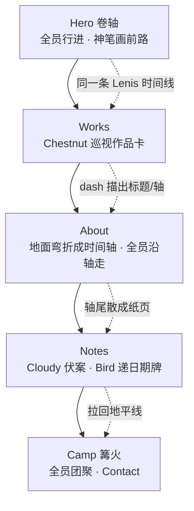

# lucky 个人主页 — 设计与开发方案
# lucky Portfolio — Design & Development Plan

> 版本 v1.1 · 中英双语 · 依据：参考图 × 设计提示词 × 用户决策  
> Status: Spec locked for build — 可进入 M0 手感原型  
> 品牌名 **lucky** · 主标 **Code with craft. Design with soul.** · 语言 **中 + 英**

---

## 0. 结论摘要 / Executive Summary

**一句话：** 做一张「纸上连续世界」——右侧神笔实时画出前方道路，三只吉祥物在已画好的线稿地面上追逐；往下滚是同一场旅程，地面线弯折成时间轴，收束在篝火营地的 Contact。

| 决策 | 选择 | 理由（先说结论） |
|---|---|---|
| 品牌名 | **lucky** | 已拍板 |
| 主标 | **Code with craft. Design with soul.** | 已拍板；作 Hero 主标语 |
| 语言 | **中文 + English** | 已拍板；不做日文 locale |
| 视觉锚点 | Apple 大字留白 × 日系绘本线稿 | 负空间是「治愈」主要来源 |
| 签名机制 | 右侧画笔实时绘路 + 墨点粒子 | 全站唯一不可替代记忆点 |
| 第二签名 | 空心描边章节标题（WORKS / NOTES） | 低成本高识别 |
| 翻滚操作 | **右键 / 键盘 / 下滑**；长按仅兜底；**禁用双击** | 双击延迟高且与连跳冲突（详见 §5.2） |
| 角色分章 | **岗位向导制**（一章一主场，不铺满卡片） | 趴满作品会变贴纸墙（详见 §3.1） |
| 页面切换 | **单世界连续滚动**，非多页切换 | 保住「一条被画出来的路」隐喻（详见 §6.0） |
| 渲染 | **Canvas 2D + SVG**，不上 Pixi.js | 线稿靠路径噪声，不需要精灵批处理 |
| 框架 | Astro + Canvas Island | Notes 要长期写，SSG 合适 |
| 失败反馈 | 踉跄 + 小星星，不扣血不通关 | Portfolio 不是硬核游戏 |

---

## 1. 品牌与叙事 / Brand & Narrative

### 1.1 定位

**边走边画的数字手艺人 / Digital craftsman who draws the road while walking.**

品牌名：**lucky**。不是「作品陈列柜」，而是「手艺人带着作品在路上」。整页是一条被画出来的路：Hero 是出发，Works 是路边摊开的作品，About 是脚印连成的履历，Notes 是路边写下的便签，Footer 是今晚的篝火。

### 1.2 口号体系（中英并行，已定稿）

| 层级 | EN | ZH | 用在哪 |
|---|---|---|---|
| **主标（Hero Display）** | Code with craft. Design with soul. | 用匠心写代码，以灵魂做设计。 | Hero 唯一大标题 |
| 副标 | Keep walking, keep drawing. | 边走边画，把每天画得更新一点。 | Hero 主标下方 |
| About 宣言 | Draw the road as we go. | 路是边走边画出来的。 | About 时间轴首 |
| 操作引导 | [LMB] Jump · [RMB] Roll ｜ [↺] ｜ [⏸] | [左键] 跳跃 · [右键] 翻滚 ｜ [↺ 重绘] ｜ [⏸ 暂停] | Hero 右下 |
| 触控引导 | [Tap] Jump · [Swipe ↓] Roll | [轻点] 跳跃 · [下滑] 翻滚 | 移动端 |
| 尾注 | Drawn on the road. | 在路上画出来的。 | Footer |

**主标写法：** Hero 两行大字

```text
Code with craft.
Design with soul.
```

中文切换时：

```text
用匠心写代码，
以灵魂做设计。
```

### 1.3 声音 / Tone of Voice

- 短句、动词开头、不堆形容词。
- 日系治愈来自「留白 + 拟人动作」，不来自文案里的「治愈」「温暖」字样。
- 中文避免翻译腔；英文避免空洞的 “passionate / creative / innovative”。
- 品牌名 **lucky** 在 UI 中保持小写词标（除非 logo 设计另有规定）。

---

## 2. 视觉系统 / Design System

### 2.1 色板 Palette

```text
--paper        #FFFFFF   纸面底
--ink          #18181A   墨线 / 正文
--ink-soft     #6B6B70   次级文字
--line-faint   #E8E8EA   分割线 / 空心字描边
--accent-lemon #FFDE59   手绘柠檬黄（背包、时钟、高亮块）
--accent-orange#FF9F43   暖雾橙（篝火、强调、hover）
--accent-sage  #70A07B   鼠尾草绿（成功、植物、标签）
--star         #FFDE59   踉跄小星星（复用 lemon）
```

**纸张噪点：** 全屏 `feTurbulence` SVG 或 512px 平铺 PNG，`opacity: 0.02`，`mix-blend-mode: multiply`。**不要画进 Canvas**。

**点缀色纪律：** 同屏最多 2 个 accent。黄=角色与工具，橙=温度与行动点，绿=自然与标签。

### 2.2 字体 Typography

| 用途 | 字体栈 | 规格 |
|---|---|---|
| Display EN | `"SF Pro Display", "Inter", -apple-system, sans-serif` | 72–128px / 500–600 / tracking -0.02em |
| Display 空心标题 | 同上 | 描边 2px `--line-faint`，填充 transparent |
| CJK Display | `"Noto Sans SC", "PingFang SC", "Source Han Sans SC", sans-serif` | 28–40px / 500 |
| Body EN | Inter / SF Pro Text | 16–18px / 400 / lh 1.7 |
| Body CJK | Noto Sans SC / PingFang SC | 14–16px / 400 / lh 1.9 |
| Mono（日期/代码） | `"SF Mono", "JetBrains Mono", monospace` | 12–13px |

> 语言已定为中英，CJK 字体栈改用 Noto Sans SC / 苹方；不再依赖 Zen Kaku Gothic。

**字号阶梯（桌面 / 移动）：**  
`display 96/48 · h1 72/36 · h2 48/28 · h3 28/20 · body 17/15 · caption 13/12`

**排版原则：**  
1）标题区允许占屏 40% 高度只放两行字；  
2）CJK 字重只用 400/500，不用 700；  
3）英文 Display 负字距，中文 Display 微正字距 `+0.04em`。

### 2.3 线稿语言 Line Quality

| 元素 | 规范 |
|---|---|
| 线宽 | 主地面 2px，装饰 1.5px，细节 1px |
| 颜色 | 统一 `#18181A` |
| 抖动 | 路径细分后对顶点叠加 2D value noise（振幅 0.6–1.2px，频率 0.08） |
| 端点 | `round` cap / `round` join |
| 断笔 | 长路径每 80–120px 随机 4–8px 缺口，缺口率 ≤ 8% |
| 填充 | 角色与道具允许白填充 + 墨线；场景地面不填充 |

**实现顺序：** 光滑折线 → noise 抖动 → 挖断笔缺口。

### 2.4 间距与布局 Grid

- 基础单位 `8px`；节奏 `8 / 16 / 24 / 40 / 64 / 96 / 128`。
- 内容最大宽 `1120px`；Hero 文案块 `720px`。
- 桌面安全边距 `64px`，移动 `20px`。
- 章节垂直呼吸 128–180px；Works 卡间距 24px。
- Bento：12 列不对称；卡片圆角 20px，边框 1.5px ink。

---

## 3. 角色设定 / Mascot Cast

三只角色是一支「行进小队」，不是三个独立 IP 挂件。队形固定：栗子鼠领跑 → 云朵兔居中 → 煤球鸟压阵。

| 角色 | EN | 造型 | 步态 | 色 |
|---|---|---|---|---|
| 栗子鼠 | Chestnut | 圆滚花栗鼠，竖耳，背柠檬黄小背包 | 匀速小跑，尾微翘，背包带轻弹 | 棕 + `#FFDE59` |
| 云朵兔 | Cloudy | 纯白垂耳兔，圆身短腿 | 走路微弹，耳朵滞后摆动 | 白 + 墨线 |
| 煤球鸟 | Kuro-Kuro | 豆豆眼纯黑小毛团，细腿 | 快频碎步，身体略滞后跟上 | `#18181A` |

**行进绑定规则：**
- 贴地：脚底锚点 = `y = terrain(x)`，法线对齐（小坡 ±12°）。
- 三人共享 x 速度，弹性间距 12–20px，急停「追尾」保留。
- 跳跃：错发起跳延迟 0 / 40 / 80ms。
- 翻滚：变球自转 720°/0.55s，hitbox 高度 × 0.4。
- 踉跄：前扑 → 坐地 0.35s → 星星×3 → 1.2s 追回队形（1.15× 再回落）。

**绘制：** SVG path + GSAP/CSS，不进 Canvas（与地形解耦，方便章节复用）。

### 3.1 分章出场：岗位向导制（已定，优于「每卡趴满」）

**原则：**  
1）**完整三只编队**只出现在 Hero 与 Camp（叙事头尾）；  
2）内容章节**一章一主场角色**，副角最多 1 只点缀；  
3）**不要**让三只都趴在每张作品边上——那是贴纸墙，会抢走作品信息。

| 章节 | 主场 | 主姿态与职责 | 副角（最多 1） | 交互反馈 |
|---|---|---|---|---|
| **Hero** | 全员 | 路上行进小队，追逐画笔 | — | 跳 / 滚 / 踉跄 |
| **Works** | **栗子鼠 Chestnut** | 「检视员」：掀开特色卡一角探头、趴在卡上沿晃脚、戴背包当小小验收员 | 煤球鸟停在外链 `↗` 上当指针 | hover 卡片 → 鼠敲敲卡面；鸟被点一下跳开再落回 |
| **About** | 全员（沿轴走） | 沿时间轴继续前进，经过节点踩一脚「盖章」 | 节点处兔坐里程碑 | 滚动 scrub 跟随轴线 |
| **Notes** | **云朵兔 Cloudy** | 伏案写字、按图钉、吹干墨迹 | 煤球鸟衔日期小牌 | hover 行 → 兔抬笔；鸟递出日期牌 |
| **Camp** | 全员 | 篝火团聚烤棉花糖（收束） | — | 兔举棉花糖，鸟蹲最近火 |

**Works 卡片放置细节（推荐，而非「三只都趴」）：**
- 特色大卡 A（左）：Chestnut **趴上沿、垂腿晃**，背包朝外。
- 特色大卡 B（右）：Chestnut 在本屏只出现一次（跨卡「巡视」走位），或 B 卡由 **空 + 插画** 承担，避免复制粘贴感。
- 小 Bento 卡：不放角色，只放手绘图标动画。
- 外链 `↗`：Kuro-Kuro **单脚站在箭头上**，全站最多 1–2 处。

**移动端：** 每章只保留主场角色；Hero/Camp 可保留 2 只（Kuro-Kuro 可省）。

---

## 4. 核心机制：神笔画路 / Pen Drawing System

这是全站灵魂。任何功能冲突时，保画笔。

### 4.1 坐标与锚定

```text
世界坐标 x_world(t) = 自动向右卷动
绘制点 (X_draw, Y_draw) = (viewport.w * 0.85, terrain(x_at_pen))
```

- 画笔**屏幕位置**固定在约 85% 视口宽（右边距 10%–15%），Y 随地形起伏。
- **笔尖**严格锁在「路径最前端」屏幕投影点。
- 新线段被画出，旧线段离场——「未来在眼前被画出来，角色在身后追逐」。

### 4.2 姿态

| 参数 | 规则 |
|---|---|
| 倾角 θ | `θ = clamp(atan2(dy,dx) * 0.85, -15°, +15°)`，切线低通 0.15 |
| 下压 | 笔尖接触新顶点 80ms 内，沿法线位移 2px + scale(0.98) |
| 噪声 | 笔身旋转叠加 ±0.8° 1D noise |
| 尺寸 | 笔长 ≈ 视口高 18%（移动 14%），≥ 72px |

### 4.3 墨迹粒子

- 发射点：笔尖，3–5 颗/秒（泊松抖动）。
- 形态：1–2px 墨点 / 铅屑 / 四角星光，比例 3:6:1。
- 初速：切线前方 40–90px/s + 法线向上 20–40px/s，重力 200px/s²。
- 寿命 0.35–0.6s，ease-out 淡出；池化上限 64，禁止每帧 `new`。

### 4.4 隐喻强化

1. **Idle 演示：** 4s 无输入，画笔自动画一小段波浪并停顿；用户一操作即停。
2. **自定义光标：** 离开 Hero 后光标为细笔尖；Works hover 时笔尖轻点一下。
3. **Redraw：** `?seed=` 可分享同一条路；↺ 换 seed，墨粒爆簇 8 颗。

---

## 5. 地形与交互 / Terrain & Controls

### 5.1 地形生成（连续流动）

| 类型 | 出现 | 处理 | 占比 |
|---|---|---|---|
| 平缓草地 | 基础 | 装饰草花 | 35% |
| 缓坡起伏 | 常规 | 贴地倾斜 | 20% |
| 小溪 / 土坑 / 圆石 | 低位障碍 | **跳** Jump | 20% |
| 石桥孔 / 树洞 / 山洞 | 高位障碍 | **翻滚** Roll | 15% |
| 装饰（小屋/蘑菇/树） | 纯视觉 | 不碰撞 | 10% |

**视差：** 远景 0.2×（远山、云、钟楼）· 中景 0.5× · 前景 1.0×。  
**Seed：** 可播种；演示默认 `seed=20260215`；`?seed=42` 可分享。

### 5.2 输入（翻滚方案已定）

#### 结论：双击不合适；长按优于双击但仍不如右键

| 方案 | 延迟 | 与跳跃冲突 | 可发现性 | 裁决 |
|---|---|---|---|---|
| **左键双击 = 翻滚** | 高（两次点击） | **严重**：连跳会被解析成双击；跳+滚歧义 | 差 | **禁用** |
| 左键长按 200ms = 翻滚 | 中 | 中：按住期间不能跳 | 中 | **仅单键兜底** |
| **右键 = 翻滚** | **即时** | **无**（左右键分离，可并行） | 中（需引导） | **桌面主方案** |
| 键盘 Shift/S/↓ | 即时 | 无 | 好（无障碍） | **桌面主方案** |
| **下滑 = 翻滚** | 即时 | 无 | **好** | **触控主方案** |

**定稿绑定：**

| 输入 | 动作 | 视觉 |
|---|---|---|
| 左键 / 单指轻点 / Space / ↑ | **Jump** `vy=-820`，`g=2200` | 脚下 3 道气流弧线 0.25s |
| **右键** / Shift / S / ↓ | **Roll** hitbox×0.4，自转 0.55s | 侧向气流 + 轻尘 |
| **单指向下滑**（触控主） | **Roll** | 同上 |
| 左键长按 ≥200ms | Roll（**仅当无右键设备**的兜底） | 同上 |
| 双指长按 | Roll 别名（保留兼容，不写进引导） | 同上 |
| Esc / ⏸ | 暂停卷动与物理（含粒子） | 轻度去饱和 |
| ↺ | 换 seed 重绘 | 墨点爆簇 |

**硬性：** canvas 上 `contextmenu` 必须 `preventDefault()`，否则右键菜单会毁掉翻滚。

**引导文案只写主方案：**  
`[左键] 跳跃 · [右键] 翻滚` / `[轻点] 跳跃 · [下滑] 翻滚`  
不要把长按写进默认提示，避免教学过载。

**判定宽容度：**
- Jump：有效区 ±6px；Input Buffer 0.08s + Coyote 0.08s。
- Roll：输入 Buffer 0.06s；洞口检测用压缩后 hitbox。
- 失败不打断：无 Game Over、无计分惩罚。

### 5.3 物理参数（初值）

```text
gravity          2200 px/s²
jumpImpulse     -820 px/s
rollDuration      0.55 s
rollSpin         720 deg
moveSpeed         180 px/s
hitStop           80 ms
rejoinBoost       1.15×
inputBufferJump   0.08 s
inputBufferRoll   0.06 s
coyoteTime        0.08 s
longPressRoll     200 ms   (fallback only)
```

---

## 6. 页面结构与转场 / IA & Transitions

### 6.0 转场总原则（已定）：单世界连续滚动，不是多页切换

**结论：** 不做「下滑分页 / scroll-snap / 路由硬切」。全站是**同一条被画出来的路**，滚动 = 旅程推进。

| 方案 | 评价 | 裁决 |
|---|---|---|
| 多页路由硬切 | 画路隐喻断裂，闪白出戏 | 否决 |
| scroll-snap 分页 | 打断连续绘制与角色跑动 | 否决 |
| **Lenis 惯性滚动 + ScrollTrigger 连续叙事** | 一条时间线，笔迹/角色/章节同源 | **采用** |

**转场机制：**

```text
导航点击 ──► Lenis.scrollTo(anchor, 0.9s, ease)
                │
                ▼
        同一 ScrollTrigger 时间线 scrub
                │
    ┌───────────┼───────────┬─────────────┐
    ▼           ▼           ▼             ▼
 空心标题     地面线弯折   角色岗位切换   视差换层
 dash 描出    Hero→About   走位/入场     0.2x / 0.5x
```

1. **Hero → Works：** 卷轴仍在，地面线从脚下延伸为章节顶饰；空心 `WORKS` 用 stroke-dash 画出；Chestnut 走到第一张卡旁「上岗」。
2. **Works → About（签名转场）：** 地面线**向下弯折 90°** 变成时间轴主轴；角色小队改沿轴向下走；画笔改为纵向描轴（倾角随之转到接近竖直，限制 ±15° 相对路径切线）。
3. **About → Notes：** 轴线末端散开成纸页纹理；Cloudy 从轴旁走进 Notes 写字台。
4. **Notes → Camp：** 列表收拢，场景拉回地平线；三只在篝火旁集合；画笔画完最后一笔火苗。

**二级路由唯一例外：** Notes 详情页。离开列表时做「翻开笔记本」微转场（纸色 crossfade 240ms + 页角卷起），返回用合上。不要做全屏滑入滑出。

**导航：** 毛玻璃胶囊锚点跳转（Works / About / Notes / Contact + 中/EN）。禁止整页 reload 切换语言——字典热替换，场景与滚动位置保持。

### 6.1 Hero 首屏

- **顶部导航：** 毛玻璃小胶囊。品牌 **lucky** + 小笔尖 logo 居左。
- **核心标语：**
  - Display EN：`Code with craft. Design with soul.`
  - ZH：`用匠心写代码，以灵魂做设计。`
  - 副标：`边走边画，把每天画得更新一点。` / `Keep walking, keep drawing.`
- **底部：** 连续地面线 + 三只角色 + 右侧画笔画前方。
- **右下操作指南：**  
  `[左键] 跳跃 · [右键] 翻滚 ｜ [↺ 重绘] ｜ [⏸ 暂停]`  
  移动：`[轻点] 跳跃 · [下滑] 翻滚`

### 6.2 Works 作品

- 空心标题 `WORKS` + `精选项目 / Selected projects`。
- **第一行：特色大卡 ×2（左右交错）**；插画 → 标题 → 一句价值主张 → 元数据 → `↗`。
- **第二行：Bento 3–4 格** 小项目/实验。
- **角色：** Chestnut 巡视员（卡上沿晃脚/掀角）；Kuro-Kuro 站在 `↗` 上。Bento 不放角色。
- Hover：卡 `translateY(-4px)` + 图标动画 + Chestnut 敲卡面。

**内容占位（可替换）：**

| 项目 | ZH | EN |
|---|---|---|
| TimeSense | 「快一点」会变成习惯的约定。 | A little faster becomes a habit. |
| SwingCat | 集中时的那点悠哉。 | A little ease while you focus. |
| lucky Road | 用一支笔画出可走的路（本站）。 | Draw a walkable road with one pen. |
| Ship Notes | 给独立开发者的轻量发布清单。 | A tiny ship checklist for indie makers. |

### 6.3 About 线稿时间轴（签名滚动段）

- 地面线弯折 90° 成时间轴；滚动驱动 `stroke-dashoffset` 描出轴线。
- 宣言：`Code with craft. Design with soul.`（与 Hero 同源，可短句变体 `Draw the road as we go.`）
- **角色：** 三只沿轴向下走，节点触发小动作（踩年份盖章、兔坐里程碑）。

条目示例：
- 2024 — 独立开发，发布 TimeSense
- 2025 — 开源 UI 组件与手绘图标集
- 2026 — lucky / 本站，把「边走边画」做成产品隐喻

### 6.4 Notes 手记

- 空心 `NOTES` + `制作手记 / Making notes`；右上 `阅读全部 ↗`。
- 列表：`日期 · 标题 · ↗`，1px 分割线，克制无阴影。
- **角色：** Cloudy 伏案；Kuro-Kuro 衔日期牌。

### 6.5 Footer 终点营地

- 空心 `CONTACT` + `打个招呼 / Say hello`。
- 画笔画出篝火（最大化 `#FF9F43`）；三只烤棉花糖。
- CTA：邮箱大链接（可配 `hello@lucky.dev`）+ 社交图标。
- 版权：`© 2026 lucky · Drawn on the road.`

---

## 7. 技术架构 / Technical Architecture

### 7.1 栈选型

| 层 | 选择 | 不选的理由 |
|---|---|---|
| 站点框架 | **Astro 5** + 内容集合（Notes） | 纯 HTML 难维护 Notes；Next 过重 |
| 场景渲染 | **Canvas 2D** | 线稿噪声即可；WebGL/Pixi 无收益 |
| 矢量 UI | SVG（角色、插画、图标） | 可访问、可 CSS/GSAP |
| 动效 | **GSAP 3 + ScrollTrigger** | 连续叙事成熟 |
| 平滑滚动 | **Lenis** | 与 ScrollTrigger 集成简单 |
| i18n | 自研字典 + `zh-CN` / `en` | 仅两语，不必上 i18next |
| 样式 | Tailwind CSS 4 或原生 CSS | Token 少时原生更干净 |
| 语言 | TypeScript | 地形/物理需要类型 |
| 部署 | 静态托管 | 无服务端需求 |

**原型阶段：** 先单文件 `paper-road/index.html`（Canvas + GSAP CDN）验证手感；通过后再拆 Astro。

### 7.2 运行时结构

```text
┌──────────────────────────────────────────────┐
│  DOM（语义 HTML / zh-en 字典热替换）          │
│  Nav · Hero · Works · About · Notes · Camp    │
├──────────────────────────────────────────────┤
│  SVG（角色岗位节点、插画、纸噪、光标）        │
├──────────────────────────────────────────────┤
│  Canvas（Hero 卷轴场景 + About 纵向描轴）     │
│  视差地形 · 手绘路径 · 画笔姿态 · 墨粒池      │
└──────────────────────────────────────────────┘
          ▲ rAF（暂停 cancel）／ scroll scrub
```

**关键模块：**
- `terrain.ts` — seedable 段落生成器
- `inkPath.ts` — 折线 → 抖动 → 断笔 → Path2D
- `pen.ts` — 笔姿态、下压、粒子
- `mascots.ts` — 行进状态机 + **章节岗位脚本（roles）**
- `scene.ts` — 主循环、暂停、Redraw
- `scrollStory.ts` — 连续世界转场、地面弯折、角色走位
- `i18n.ts` — zh-CN / en 字典与切换（不重载场景）

### 7.3 坐标与卷动

```text
cameraX += speed * dt
drawX  = cameraX + viewportW * 0.85
screenPen = (0.85 * vw, heightAt(drawX) - cameraY)
```

路径为世界系 polyline（≤2048 点，出队裁剪）；**碰撞与绘制共用同一几何**。

---

## 8. 动效与手感 / Motion & Game Feel

| 事件 | 动效 | 时长 | 缓动 |
|---|---|---|---|
| 起跳 | 气流弧线×3；拉伸 y1.08 | 0.25s | `power2.out` |
| 落地 | 压缩 y0.92 弹回；尘点 | 0.18s | `back.out(2)` |
| 翻滚 | 自转 720°；hitbox 压缩 | 0.55s | `power1.inOut` |
| 踉跄 | 前扑→坐地→星星×3→追队 | 1.5s | 分段 |
| 路径出现 | 即时画出（无淡入） | — | — |
| 墨粒 | 淡出 + 微重力 | 0.35–0.6s | `power1.out` |
| Works hover | 卡上浮 + Chestnut 敲卡 | 0.35s | `power3.out` |
| 空心标题 | stroke-dash 描出 | 0.8s | `power2.inOut` |
| 地面→时间轴 | 路径 morph + dashoffset | scroll scrub | linear |
| 章节角色上岗 | 走位/趴卡/伏案 | 0.6–0.9s | `power2.inOut` |
| 锚点跳转 | Lenis 滚动 | 0.9s | 自定 ease |
| Notes 详情打开 | 「翻开笔记本」纸色 crossfade | 0.24s | `power2.out` |

**手感优先级：** 跳跃抛物线 > 翻滚时长 > 其他。调到「盲按能过 80% 障碍」。

---

## 9. 响应式 · 无障碍 · 性能

### 9.1 断点

| 断点 | 布局 | 场景 |
|---|---|---|
| ≥1200 | 完整 Bento | 画笔 85%；Hero/Camp 三只完整 |
| 768–1199 | Works 2 列 | 画笔 88%；角色略小 |
| <768 | 单列；标题 48px | 画笔 90%；每章仅主场角色；操作提示用触控文案 |

### 9.2 无障碍（必须做）

1. **`prefers-reduced-motion: reduce`：** 停卷动与粒子；静态线稿插画；降级为普通链接站。
2. **键盘：** Tab 可达；Space/↑ 跳；Shift/S/↓ 滚；焦点环 2px `--accent-sage`。
3. **语义：** Works 为真实 `<a>`；时间轴 `<ol>`；操作指南有 visually-hidden 说明。
4. **对比度：** 正文 `#18181A` on `#FFFFFF` ≈ 16:1。
5. **音频：** 默认关，不自动播放。

### 9.3 性能预算

| 指标 | 目标 |
|---|---|
| LCP | < 2.0s（4G） |
| Hero JS（gz） | < 120KB |
| 帧率 | 中端 60fps / 低端 30fps 可降粒子 |
| 同屏粒子 | ≤ 64 |
| 路径点 | ≤ 2048 |

降级阶梯：60fps → 减粒子 → 减断笔 → 30fps → 静态图。

---

## 10. 开发里程碑 / Milestones

| 阶段 | 内容 | 产出 | 预估 |
|---|---|---|---|
| M0 手感原型 | 地形 + 画笔 + 三角色 + 跳/滚 | 单文件可玩 60s | 2–3 天 |
| M1 视觉完成 | 线质量、粒子、视差、纸噪 | Hero 可录屏 | 2 天 |
| M2 页面结构 | Works / About 轴 / Notes / Camp | 可滚动全页 | 3 天 |
| M3 叙事转场 | 弯折、岗位走位、空心标题 | 连续世界成立 | 2 天 |
| M4 工程化 | Astro + i18n（中英）+ a11y + 性能 | 可部署 | 2–3 天 |
| M5 打磨 | 手感、真内容、真链接 | 上线候选 | 2 天 |

**M0 验收（硬）：** 画笔始终画在角色前方；右键不出菜单；**双击不触发翻滚**；失败只踉跄；暂停真正冻结。

---

## 11. 相对原提示词的改动 / Changes vs Original Brief

### 已随用户决策定稿

- 品牌名 **lucky**；主标 **Code with craft. Design with soul.**
- 语言仅 **中 + 英**（去日文 locale）。
- 翻滚**不用双击**；长按仅兜底；主方案右键 + 键盘 + 下滑。
- 角色改 **岗位向导制**，不趴满每张作品卡。
- 页面切换改 **单世界连续滚动**。

### P0 — 体验成败

1. `prefers-reduced-motion` 强制静态模式。
2. Input Buffer + Coyote Time。
3. 画线与碰撞共用同一几何。
4. 触控以「下滑翻滚」为唯一默认教学手势。

### P1 — 识别度与内容

5. 空心描边章节标题保留。
6. Notes 进 IA。
7. About 弯折转场作为第一签名（高于 Bento）。
8. Works = 特色大卡 + Bento 混合。

### P2 — 延伸与稳健

9. 画笔延伸为全站自定义光标。
10. 声音默认关（可选纸笔 ASMR）。
11. `?seed=` 可分享路径。
12. 不上 Pixi.js。
13. 极窄屏角色减负（每章主场一只）。
14. 内容 JSON/MDX + i18n key 解耦；中英切换不重载场景。

---

## 12. 双语文案清单 / Copy Inventory (ZH / EN)

### Global

| Key | ZH | EN |
|---|---|---|
| brand | lucky | lucky |
| nav.works | 作品 | Works |
| nav.about | 关于 | About |
| nav.notes | 手记 | Notes |
| nav.contact | 联系 | Contact |
| lang | 中文 | EN |

### Hero

| Key | ZH | EN |
|---|---|---|
| hero.title | 用匠心写代码，以灵魂做设计。 | Code with craft. Design with soul. |
| hero.sub | 边走边画，把每天画得更新一点。 | Keep walking, keep drawing. |
| hero.hint.desktop | [左键] 跳跃 · [右键] 翻滚 ｜ [↺ 重绘] ｜ [⏸ 暂停] | [LMB] Jump · [RMB] Roll ｜ [↺ Redraw] ｜ [⏸ Pause] |
| hero.hint.touch | [轻点] 跳跃 · [下滑] 翻滚 | [Tap] Jump · [Swipe down] Roll |

### Sections

| Key | ZH | EN |
|---|---|---|
| works.title | 作品 | WORKS |
| works.sub | 精选项目 | Selected projects |
| about.title | 关于 | ABOUT |
| about.manifesto | 路是边走边画出来的。 | Draw the road as we go. |
| notes.title | 手记 | NOTES |
| notes.sub | 制作笔记 | Making notes |
| notes.all | 阅读全部 | Read all notes |
| contact.title | 联系 | CONTACT |
| contact.sub | 打个招呼 | Say hello |
| contact.email_label | 写信给我 | Email me |
| footer.credit | 在路上画出来的。 | Drawn on the road. |

### Sample Works

| Key | ZH | EN |
|---|---|---|
| work.timesense.desc | 「快一点」会变成习惯的约定。 | A little faster becomes a habit. |
| work.swingcat.desc | 集中时的那点悠哉。 | A little ease while you focus. |

---

## 附录 A — 视觉 Token 速查

```css
:root {
  --paper: #FFFFFF;
  --ink: #18181A;
  --ink-soft: #6B6B70;
  --line-faint: #E8E8EA;
  --accent-lemon: #FFDE59;
  --accent-orange: #FF9F43;
  --accent-sage: #70A07B;
  --font-display: "SF Pro Display", "Inter", -apple-system, sans-serif;
  --font-cjk: "Noto Sans SC", "PingFang SC", "Source Han Sans SC", sans-serif;
  --font-mono: "SF Mono", "JetBrains Mono", monospace;
  --space-1: 8px;
  --space-2: 16px;
  --space-3: 24px;
  --space-4: 40px;
  --space-5: 64px;
  --space-6: 96px;
  --space-7: 128px;
  --radius-card: 20px;
  --radius-pill: 999px;
  --line-w: 2px;
}
```

## 附录 B — 连续世界叙事图



## 附录 C — 画笔锚定示意

```text
          画笔 (rotate θ ≤ 15°)
            ╲
             ╲
              ●  笔尖 = (X_draw, Y_draw) = 路径最前端
             ╱
  ~~~~~~~~~~╱~~~~~~~~~~~~~~╲~~~~  手绘地形
  🐿  🐰  🐦  （已画成的路上奔跑）
  Chestnut Cloudy Kuro-Kuro
  ────────────────────────────────►  world x
           camera 恒速右移
```

## 附录 D — 翻滚输入裁决图

```text
                    需要 Roll
                       │
         ┌─────────────┼─────────────┐
         ▼             ▼             ▼
      桌面鼠标        键盘          触控
         │             │             │
      右键立即滚    Shift/S/↓     下滑立即滚
         │
    （无右键？）
         │
    长按 200ms 兜底
         │
    ✕ 绝不绑定双击左键
       （延迟高 · 与连跳冲突）
```

---

## 下一步 / Next Steps

决策已齐（品牌 lucky、主标、中英、翻滚、角色分章、连续转场）。下一步直接进实现：

1. **M0 手感原型** — 在本仓库新建 `paper-road/`（已写入 AGENTS.md 约定），交付可玩单页。  
2. **M2–M3** — 按岗位向导制与连续世界转场铺全页。  
3. **M4** — Astro + 中英 i18n 后部署。

无需再拍板；若要改角色岗位分配或主标断行，直接改方案 §1.2 / §3.1 再实现。
